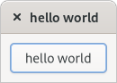
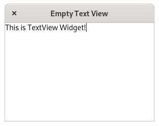
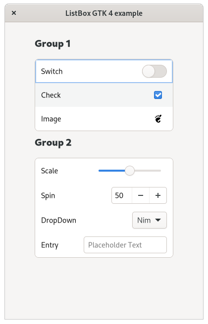
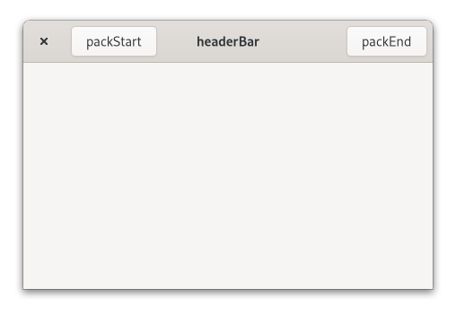
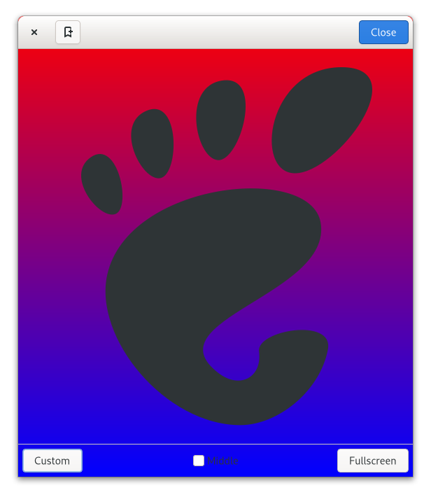
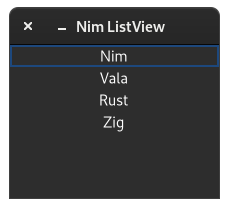

# GTK 4 Examples
## Hello Word

## TextView

## ListBox with Controls

## HeaderBar Simple

## HeaderBar CSS 

## ListView 
  
Port to nim from this [C Tutorial](https://github.com/ToshioCP/Gtk4-tutorial/blob/main/gfm/sec24.md)
